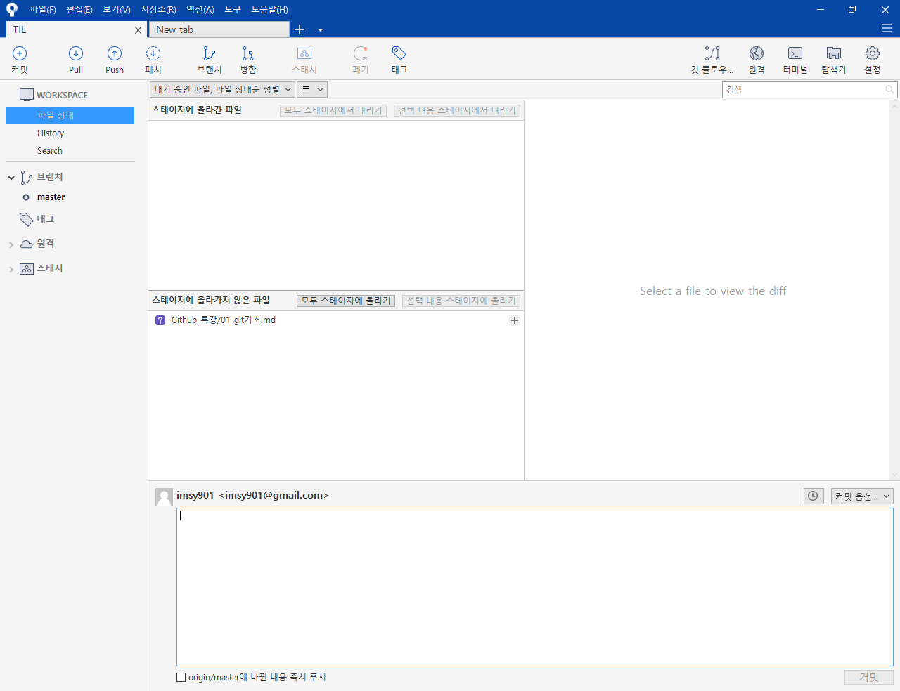

# Git 기초

## 개념

### SCM이란?

Source Cod Manger의 약자로 코드의 버전을 관리하기 위해 존재한다.

### Git

git은 Linus Torvalds가 만든 SCM 으로, 현재 가장 많이 사용된다.

### Github

github은, git이 관리하는 Repo의 원격 저장소를 제공하는 서비스이다. 오픈소스 프로젝트가 성장하는곳.

## Sourcetree

