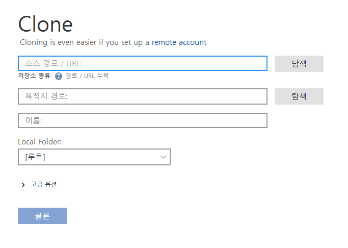

# Git 초급

## Clone

Git remote repo는 다운로드가 아니라 clone을 써야 한다.

Clone은 생성 즉시 Remote와 연결된다.

### Clone 생성

1. New Tab(Sourcetree) - Clone 선택

2. Github에서 URL 복사 후 Clone 경로 & 이름 작성
3. 생성시 Remote Repo와 자동 연결 (Github)

## Local / Remote / Clone 활용

### Local - Remote

1. Remote Repo 생성

2. Local Repo와 연결

3. Add+Commit+Push

### Clone - Remote

1. Clone 생성 (자동 연결)

2. Pull

3. Clone에서 작업 후 Add+Commit+Push (Clone > Remote)

4. Local Repo에서 Pull

