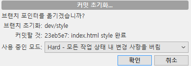

# Git 초급

## Clone

Git remote repo는 다운로드가 아니라 clone을 써야 한다.

Clone은 생성 즉시 Remote와 연결된다.

### Clone 생성

1. New Tab(Sourcetree) - Clone 선택

2. Github에서 URL 복사 후 Clone 경로 & 이름 작성
3. 생성시 Remote Repo와 자동 연결 (Github)

## Push & Pull

### Local - Remote

1. Remote Repo 생성

2. Local Repo와 연결

3. Add+Commit+Push

### Clone - Remote

1. Clone 생성 (자동 연결)

2. Pull

3. Clone에서 작업 후 Add+Commit+Push (Clone > Remote)

4. Local Repo에서 Pull

## Branching

일을 단위별로 나눠서 할 수 있도록 도움을 준다. 개발자의 선택에 따라서 branch에서 commit한 내용은 merge 하지 않고 삭제할 수도 있다.

**체크아웃을 하면 Commit 이후의 진행상황을 취소하고 당시 시점으로 돌아갈 수 있다. (체크아웃 + 청소)** 

체크아웃할 때 청소를 선택하지 않으면 과거의 작업물의 내용을 보거나 복사할 수 있음

### Master Branch

Branch에서 이루어지는 Commit들을 Merge하는 곳. Master Branch에는 Commit을 하지 않는다.

### Branch

실질적으로 Commit이 이루어 지는 곳. Branch에서 Commit한 내용을 Master에 Merge하며 Project를 진행

### Merge

각각의 Branch에서 이루어지는 Commit들을 Master Branch에 합치는 행위

​	**※Commit 이후에 되돌리고 싶을 경우**

​	: 이 커밋까지 현재 브랜치를 초기화 - Hard/Mixed/Soft



Hard

시점 이후의 모든 행위가 삭제되고 복구

Mixed/Soft

이후의 행위는 유지, Commit은 사라짐

Mixed는 Add에 올라가지 않고, Soft는 Add에 올라가있는 상태로 변경

**※ ① Work >> ② Add >> ③ Commit**

**Hard는 ① 전으로, Mixed는 ② 전으로, Soft는 ③전으로 복구**

